<div align="center">


<br>


<br>


<br><br>

<a href="https://www.linkedin.com/in/fabriziomapparicio">

</a>

<a href="https://www.instagram.com/fabriziomaia/">

</a>

<a href="mailto:fabrizio.apparicio@gmail.com">

</a>

</div>

---

# `> SOBRE MIM`

Olá! Eu sou **Fabrizio Maia**, estudante de **Engenharia de Software pela FIAP**, com experiência no desenvolvimento de soluções para **automação de processos, integração de sistemas, manipulação de dados e desenvolvimento de aplicações**.

Minha experiência profissional é principalmente voltada para a **automação de processos no setor de RH**, utilizando Python e ferramentas de automação para otimizar fluxos operacionais e aumentar a eficiência.

Tenho interesse especial por **Inteligência Artificial, desenvolvimento Backend, automação, integração de sistemas e produtos SaaS**.

---

# `> STACK TECNOLÓGICA`

### 💻 Linguagens & Desenvolvimento

<p align="center">


</p>

### ⚙️ Backend & Integrações

<p align="center">


</p>

### 🤖 Automação & Dados

<p align="center">


</p>

### 🧠 Inteligência Artificial & Visão Computacional

<p align="center">


</p>

### 🛠️ Ferramentas

<p align="center">


</p>

---

# `> EXPERIÊNCIA`

## 🏢 Decision — DHO Tech Developer

`NOV/2024 → AGO/2026`

```diff
+ Desenvolvimento de soluções para automação de processos de RH utilizando Python
+ Criação e otimização de fluxos operacionais
+ Integração de sistemas e manipulação de dados
+ Automação de processos corporativos
+ Participação em iniciativas de melhoria contínua
```

Minha atuação profissional está diretamente relacionada à utilização de tecnologia para **reduzir tarefas manuais, melhorar processos e gerar eficiência operacional**.

---

# `> PROJETOS`

<div align="center">

<table>
<tr>

<td width="50%" valign="top">

<h3>🤖 Startup de RH com IA</h3>

<p>
Projeto acadêmico de startup voltado à <b>automação e modernização de processos de Recursos Humanos utilizando Inteligência Artificial</b>.
</p>

<p>


</p>

</td>

<td width="50%" valign="top">

<h3>⚙️ Automação de Processos para RH</h3>

<p>
Soluções para automatização de fluxos operacionais, validação de documentos e integração de informações utilizando Python e ferramentas de automação.
</p>

<p>


</p>

</td>

</tr>

<tr>

<td width="50%" valign="top">

<h3>🌐 Projetos Freelance</h3>

<p>
Desenvolvimento de <b>landing pages, soluções web e automações</b> para clientes utilizando HTML, CSS, JavaScript e Python.
</p>

<p>


</p>

</td>

<td width="50%" valign="top">

<h3>👁️ IA & Visão Computacional</h3>

<p>
Desenvolvimento de soluções utilizando <b>Python, OpenCV e automação</b> aplicadas à resolução de problemas reais.
</p>

<p>


</p>

</td>

</tr>
</table>

</div>

Os projetos apresentados refletem os principais eixos da minha trajetória: **automação, Inteligência Artificial, desenvolvimento web e soluções digitais para problemas reais**.

---

# `> MISSÃO ATUAL`

```console
┌──(fabrizio㉿github)-[~/objetivos]
└─$ cat objetivos.txt

[01] ████████████████████  ENGENHARIA DE SOFTWARE
[02] ████████████████████  INTELIGÊNCIA ARTIFICIAL
[03] ███████████████████░  AUTOMAÇÃO DE PROCESSOS
[04] ██████████████████░░  DESENVOLVIMENTO BACKEND
[05] █████████████████░░░  PRODUTOS SAAS
[06] ████████████████░░░░  INTEGRAÇÃO DE SISTEMAS

> STATUS: EXECUTANDO
> PRÓXIMO OBJETIVO: TRANSFORMAR IDEIAS EM SOLUÇÕES
```

---

# `> ESTATÍSTICAS GITHUB`

<div align="center">





</div>

---

# `> CONQUISTAS`

<div align="center">



</div>

---

# `> MATRIZ DE CONTRIBUIÇÕES`

<div align="center">


</div>

---

# `> FORMAÇÃO`

```text
┌─────────────────────────────────────────────────────────────┐
│ FIAP                                                        │
│ Engenharia de Software                                      │
│                                                             │
│ FEV/2023 ─────────────────────────────── DEZ/2026           │
│                                                             │
│ STATUS: ███████████████████████████████████░  EM ANDAMENTO  │
└─────────────────────────────────────────────────────────────┘
```

Além da graduação em Engenharia de Software, possuo certificações em **Django Web Framework, Python com Orientação a Objetos, consumo de APIs, Front-End, Excel Avançado e Governança em TI**.

---

```text
╭──────────────────────────────────────────────────────────────╮
│                                                              │
│          "O FUTURO É CONSTRUÍDO, NÃO PREVISTO."              │
│                                                              │
│                    SISTEMA ENCERRADO                         │
│                                                              │
╰──────────────────────────────────────────────────────────────╯
```


</div>
